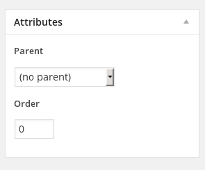
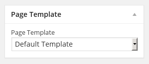

## About the Task

I've recently been working on a Wordpress plugin for a new service
we'll be releasing at Reichert Brothers in the next couple of
months. Although I haven't ever done too much in Wordpress, it
allows for some really cool things and lends itself well to rapid
development. I ran into a couple of problems when developing out
the plugin that I think might be valuable enough to get documented
and help anyone else out that may come across the same issues.

### Background

For the sake of making this easier to understand, I'll give a
little background on what I needed my plugin to accomplish. In a
nutshell, I ventured to write a 'simple' plugin that would
retrieve JSON from an external API, format it, and display it on a
Custom Post Type Page I created. I wanted to write as few of my
own custom templates as possible and inherit the templates that
the active theme makes available. The following things needed to
be achieved:

* *Create a Custom Post Type*: to display the data from an API on
   our custom pages. (not covered here)
* *Add meta boxes*: to filter the requests to our third part API
   (not covered here)
* *Allow the user to pick a template*: for their Custom Post Type
   Pages. These templates should not be hardcoded and should be
   the same templates that the active theme offers (full-width,
   left-sidebar, etc).

We'll be covering the third bullet - allowing the admin to pick a
different template for each of our Custom Post Type pages.

### The Problem

When creating a new custom post type, Wordpress does allow for authors
to add the `page-attributes` capabilities to their posts. But they don't
include the Template dropdown (see fig 1.1). As a matter of fact, they
explicity hardcode it to only be allowed on `page` post types. Well, I
wanted my users to be able to pick a template offered by their active
theme on a page-by-page basis.

<div style="text-align:center">

</div>

The most common solution I found was to register a setting for the
admin where they could pick one template to take effect on all of
those custom post type pages. But let's say my custom post type is for
restaraunt menus. Well, now the restaraunt needs two pages: one for
their lunch menu and one for the dinner menu. The lunch menu is much
smaller and thus doesn't need a 'full-width' layout. But the dinner
menu is large and the admin doesn't want anything else on that
page. Now do you see why we might need the ability to choose a
template on a page-by-page basis. At least this was my though process.


## Diving In

Well in the end, I ended up figuring out what I think is a decent
solution. I don't think I 'invented' this solution, because I bet
there a many other people out there doing the same thing, but let's
take a look.

### TL;DR Solution

We'll leverage the use of Meta Boxes to provide our own dropdown
menu. Then we'll save that setting in our `post_meta`, retrieve that
setting when our CPT pages are loaded, and show the correct
template. Pretty simple!


### Registering the Meta Box

First, we'll start off by creating our meta box for our Custom Post
Type. If you've never used meta boxes before, I recommend taking a
look at
the
[WP Codex Function Reference for =add_meta_box=](http://codex.wordpress.org/Function_Reference/add_meta_box). It
gives some great examples and provides plenty of info on how to set
one up. Keep in mind all of this is from a plugin. I won't go into
setting all of that up in this blog, but that's where we'll be working
from.

Let's set up our meta box! I'll touch on the important methods and
settings, but I'll leave out explaining the irrelevant ones. Our code:

```php
  function cptTemplateMetaBox() {
    add_meta_box(
      'cpt-template-meta-box'
      , __( 'Page Template', 'my-cpt-textdomain' )
      , 'postTemplateMetaBoxMarkup'
      , 'my-cpt-name'
      , 'side'
      , 'core'
    );
  }
  add_action( 'add_meta_boxes', 'cptTemplateMetaBox' );
```

Ok so we've successfully created our Meta Box (even if it's not doing
anything yet.) Let's go through these the `add_meta_box` function and
see what we're setting up.

* *cpt-template-meta-box*: is simply the html ID that wordpress will give our meta box when it's put on the page.
* *__( 'Page Template, 'cpt-textdomain' )*: is the title that wordpress will give our meta box when it's rendered.
* *postTemplateMetaBoxMarkup*: is the name of the function we're
  about to define that will render the markup to go inside of our
  meta box.
* *my-cpt-name*: is the name of our custom post type for which to load our meta box.
* *side*: is where our meta box will go. On the side, since that's
  where the normal one would be.
* *core*: This field is the 'priority' of the meta box.
* *add_action*: registers the meta box.


### Rendering the Meta Box
Now that we have registered our Meta Box, it's time to give it
some markup. Basically, we'll just generate one simple dropdown
box that has a list of all the currently available
templates. Since this part is a little more detailed than the
previous code snippet, I commented inline what everything is
doing. Here's the code:

```php
  function postTemplateMetaBoxMarkup( $post ) {
      // create a nonce for verification (not covered in this post)
      wp_nonce_field( basename(__FILE__), 'cpt_template_meta_nonce' );

      // we get the cpt_page_template meta field from the database when we load
      // the admin panel. We haven't saved on yet, but when we do it'll be here.
      $current_template = get_post_meta( $post->ID, 'cpt_page_template', true);
      // the get_page_templates() function retrieves all of the currently enabled
      // templates.
      $template_options = get_page_templates();

      // start creating our markup
      // first we create a label, the 'for' attribute should match the 'name' of the <input> we
      // want to save.
      $box_label = '<label for="cpt_page_template">Page Template</label>';
      // <select> wrapper around our options. notice the 'name' == 'for' from above
      $box_select = '<select name="cpt_page_template">';

      // we give a Default option which will default to whatever the theme's default
      // template is.
      $box_default_option = '<option value="">Default Template</option>';
      $box_options = '';

      // here's the meat. For EACH of the available templates, create an <option> for it,
      // and put it in our <select> box.
      foreach (  $template_options as $name=>$file ) {
          if ( $current_template == $file ) {
              $box_options .= '<option value="' . $file . '" selected="selected">' . $name . '</option>';
          } else {
              $box_options .= '<option value="' . $file . '">' . $name . '</option>';
          }
      }

      // echo our markup (you should return it, but we won't do that here).
      echo $box_label;
      echo $box_select;
      echo $box_default_option;
      echo $box_options;
      echo '</select>';
  }
```

Note, we don't have to register this function with any hooks or
filters because it's called directory from the =add_meta_box=
function. Now we should have a fully rendered meta box on our Custom
Post Type Pages. It's not saving any settings yet, but now we can
start persisting the selection. (See fig 1.2)

<div style="text-align:center">

</div>


### Persisting the Meta Box Data
Wordpress makes saving the data from the Meta Box really
simple. In our case, it's going to see our select box and look for
the =selected= option. Since this isn't a meta box tutorial, I'll
leave out the details of how the saving works. All we need to know
is that the field saved, and what the name of the saved field
is. Here's the code:

```php
  function postTemplateMetaBoxSave( $post_id ) {
      $current_nonce = $_POST['cpt_template_meta_nonce'];
      $is_autosaving = wp_is_post_autosave( $post_id );
      $is_revision   = wp_is_post_revision( $post_id );
      $valid_nonce   = ( isset( $current_nonce ) && wp_verify_nonce( $current_nonce, basename( __FILE__ ) ) ) ? 'true' : 'false';

      // if the post is autosaving, a revision, or the nonce is not valid
      // do not save any changed settings.
      if ( $is_autosaving || $is_revision || !$valid_nonce ) {
          return;
      }

      // Find our 'cpt_page_template' field in the POST request, and save it
      // when the post is updated. Note that the POST field matches the
      // name of the select box in the markup.
      $cpt_page_template = $_POST['cpt_page_template'];
      update_post_meta( $post_id, 'cpt_page_template', $cpt_page_template );
  }
  add_action( 'save_post', 'postTemplateMetaBoxSave' );
```

Add the end we hook into `save_post` with `add_action`, and run this
function when the post is saved. This saves a field called
`cpt_page_templates` in our database for this specific post. We can
access this field when the page is loaded.

### Retrieving the template on the front end
This is the fun part. Now we have a shiny new meta box on our
admin post pages, and a field in the database for each post
telling us what template to show. So let's show it!

Fortunately this part is also pretty straightforward, and only
requires a single function. Again I commented this inline since it
flows pretty linearly. Let's take a look code:

```php
  function loadMyCptPostTemplate() {
      // get the queried object which contains the information we need to
      // access our post meta data
      $query_object = get_queried_object();
      $page_template = get_post_meta( $query_object->ID, 'cpt_page_template', true );

      // the name of our custom post type for which we'll load a template
      $my_post_type = 'my-cpt-name';

      // create an array of default templates
      $default_templates    = array();
      $default_templates[]  = 'single-{$query_object->post_type}-{$query_object->post_name}.php';
      $default_templates[]  = 'single-{$query_object->post_type}.php';
      $default_templates[]  = 'single.php';

      // only apply our template to our CPT pages.
      if ( $query_object->post_type == $my_post_type ) {
          // if the page_template isn't empty, set it as the default_template
          if ( !empty( $page_template ) ) {
              echo 'need to load ' . $page_template;
              $default_templates = $page_template;
          }
      }

      // locate the template and return it
      $new_template = locate_template( $default_templates, false );
      return $new_template;
  }
  add_filter( 'single_template', 'loadMyCptPostTemplate' );
```

The `add_filter()` function at the end is important. It allows to hook
into the query and change the template to be displayed. In our case,
we intercept the query, run a function to see which template we had
saved, and load that instead. Also notice that we set a default
template. So if the post had no saved option, or something went wrong
when trying to find it, it won't fail.

## Summary
So that's about it. The new template should load with all of the
regular post content in the body. The only problem I've noticed is
that some themes won't show the page's content on more specialized
templates (like a Contact Page template), but this is pretty much
expected and it has always worked for the more commen Full Width, Left
Sidebar, etc, templates. This code is a little out of context, but the
general idea is there and easy to adapt to any plugin.


:: Cody Reichert
